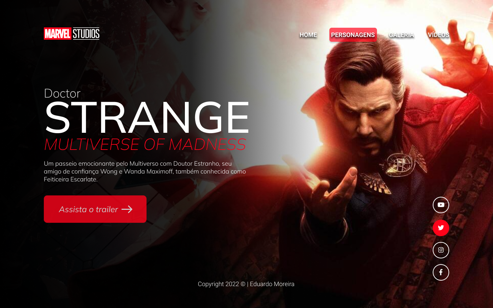
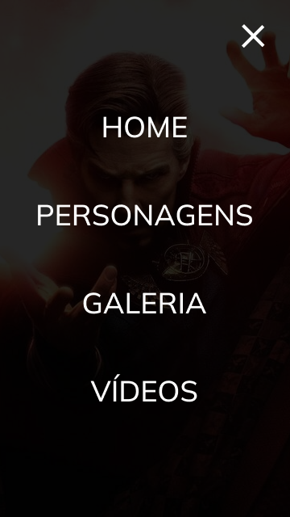

# Doutor Estranho

Projeto construido durante as aulas de LIMA, no curso de Desenvolvimento de Sistemas do [SENAI Jandira](https://jandira.sp.senai.br/), com orientação do Prof. [Fernando Leonid](https://github.com/fernandoleonid)

 

## Qual era o objetivo do projeto?
O objetivo era criar uma landing page com base no design feito no figma, aprendendo a estrutura do HTML, CSS, JS e conceitos de responsividade.

---

## O que é Landing Page?
Landing Pages são páginas com foco principal na conversão de visitantes, assim, essas páginas possuem uma estética mais minimalista comparada com os sites tradicionais.

---

## Tecnologias usadas
- HTML 5
- CSS 3
- JavaScript
- Figma

---

## Links
- [Resultado](https://eduardomoreiramachado.github.io/strange-2022/)
- [Projeto no Figma](https://www.figma.com/file/b8dAlQun0K4fi1wv9N1SDG/LIMA?node-id=0%3A1)
- [Código](https://github.com/EduardoMoreiraMachado/strange-2022)

---

## Autor
[Eduardo Moreira](https://github.com/EduardoMoreiraMachado)
